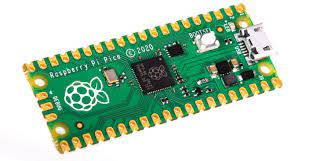
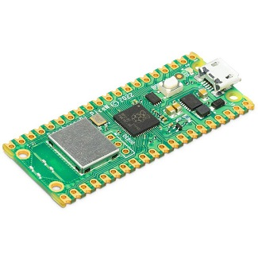

# Introduction

Le Raspberry Pi Pico est une carte de développement très puissante et pas cher. Il y a possibilité d'utiliser le langage de programmation MicroPython ou C++. &#x20;

Il existe 2 variantes, une variante avec et sans wifi.&#x20;

<figure><figcaption>
Raspberry PI Pico
</figcaption></figure>

<figure><figcaption>
Raspberry Pi Pico W (avec wifi) 
</figcaption></figure>

Voici les caractéristiques principales:

* Microcontrôleur RP2040 ARM cCortex M0
* 64kb de mémoire SRAM
* 2Mb de mémoire FLASH&#x20;
* Horloge de travail jusqu'à 133 MHz
* 32 bits
* Dual core
* Mode basse consommation
* Fonctionne à 3.3 volt

L'outils de développement Thonny sera utilisé pour programmer la carte en MicroPython dans ce cours et nous verrons une brève introduction de ce langage.

&#x20;
