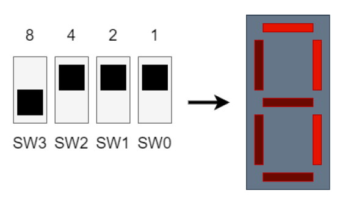

# Ex 4: Convertisseur bin - 7 seg

A l’aide des boutons « SW0 » à « SW3 », créez un programme permettant de convertir les valeurs binaires reçues par ces 4 boutons pour les afficher sur l’un des afficheur 7 segments.

<figure><figcaption></figcaption></figure>

Les valeurs à afficher sont en hexadécimal allant de 0 à F.

