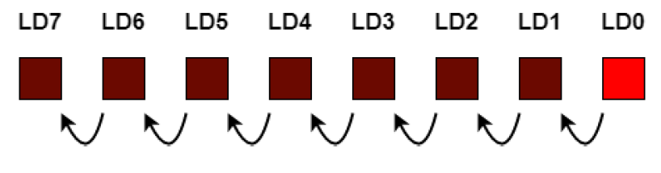

# Ex 7: Chenillard

Mettez au point un programme permettant de faire défiler une LED en partant de LD0 à LD15 de façon cyclique.

<figure><figcaption></figcaption></figure>


Utilisez une détection de flanc à l’aide de l’entrée « CLK ».


Créez une variable qui sera incrémentée de 1 à chaque passage dans l’événement qui devra entrer dans une condition ayant une valeur à ne pas dépasser de 16000000. C’est dans cette condition que vous ferez le code permettant d’allumer / éteindre les LED désirées.
