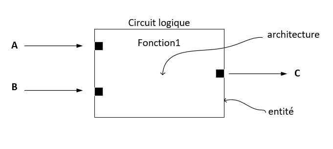

# Entité et architecture

Un système digital peut être vu comme une boîte noire, de la même façon qu'une fonction en programmation. On connaît les entrées et les sorties mais on ignore le contenu.

En VHDL, la boîte noire est nommé entité (entity en anglais). Une entité est toujours associée à une architecture qui correspond à la description de son contenu.

<figure><figcaption></figcaption></figure>

##
