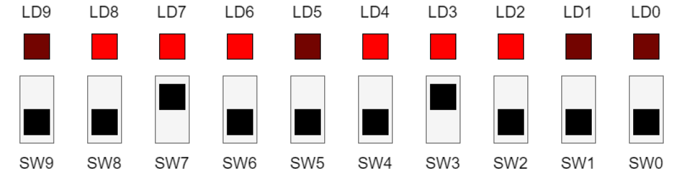

# Ex 3: Allumage simultané

A l’aide de tous les boutons, réalisez un programme en VHDL permettant d’allumer les trois LED se situant proche du bouton qui est passé à 1 comme le démontre l’exemple ci-dessous.

<figure><figcaption></figcaption></figure>
