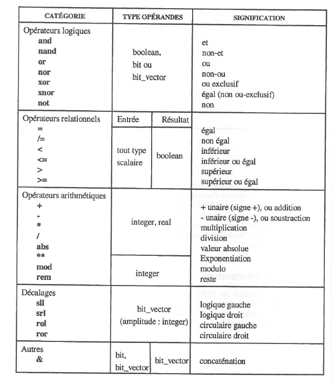

# Opérateurs

Voici les opérateurs prédéfinis du VHDL.

<figure><figcaption></figcaption></figure>


Afin d'éviter toute erreur de priorité d'opérateur, il ne faut pas hésiter à utiliser des parenthèses.


Voici un exemple concernant les opérateurs de décalage et rotation:

```vhdl
constant moins_77: std_logic_vector(7 downto 0):= "10110011" ;
constant moins_39: std_logic_vector(7 downto 0):= moins_77 sra 1 ; --11011001
constant plus_89 : std_logic_vector(7 downto 0):= moins_77 srl 1 ; --01011001
constant plus_103: std_logic_vector(7 downto 0):= moins_77 rol 1 ; --01100111
```

