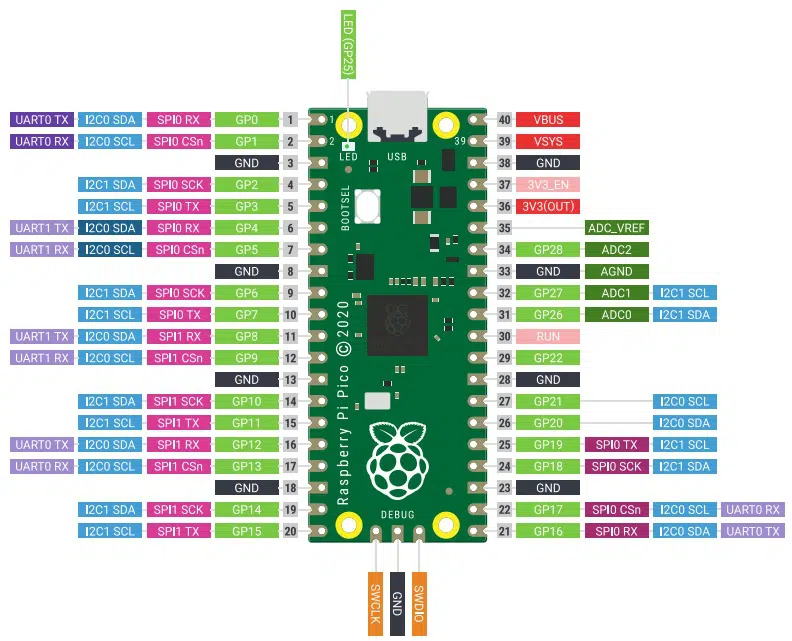

# Brochage (Pinning)

La carte est dotée de 26 GPIO (general purpose input/output). Ces pins peuvent être programmées en entrée ou sortie et n’ont pas d’attribution fixe. Certaines pins ont des spécificités et peuvent être utilisées pour communiquer avec d'autre hardware. D’autres pins sont utilisés pour l’alimentation.

<figure><figcaption></figcaption></figure>

* 26 pins multifonction GPIO
* 2 bus de communication SPI
* 2 bus de communication I2C
* 2 UART
* 3 ADC 12 bits
* 16 PWM

La datasheet du Raspberry Pico:



