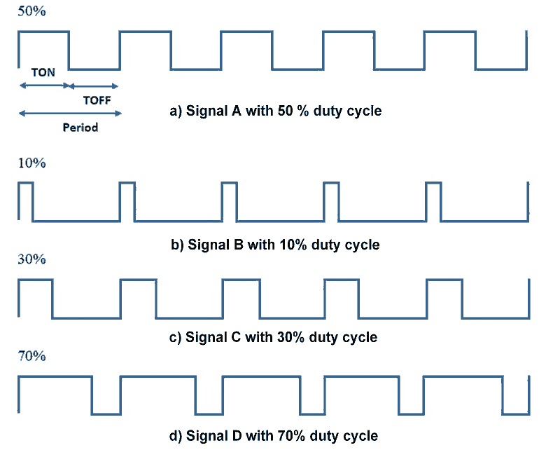

# Varier l'intensité d'une led

Dans les premiers exercices, nous avons allumé ou éteint une led. A présent, nous allons faire varier l'intensité lumineuse. Pour cela, nous allons utiliser une GPIO configurée en PWM.&#x20;

## Qu'est-ce qu'un signal PWM?

PWM signifie Pulse Width Modulation (en français: modulation de largeur d'impulsions). Il s'agit d'un signal carré avec une fréquence définie dont la durée à l'état 1 et 0 varie, ce que l'on appelle le rapport cyclique (en anglais: duty cycle).&#x20;

<figure><figcaption></figcaption></figure>

La fréquence des 4 signaux de l'image est identique. Dans le cas a), le rapport cyclique est de 50%, la durée à 1 (Ton) est égale à la durée à 0 (Toff). Dans les 3 autres cas, le rapport cyclique est différent.

En alimentant une led avec un signal PWM, il est ainsi possible de varier sa luminosité. Le courant moyen dans la led va varier en fonction du rapport cycle. &#x20;

## Comment générer un signal PWM?

Il serait possible de générer l'équivalent d'un signal PWM avec une GPIO standard et d'écrire le code qui modifie l'état de la sortie avec une boucle et un timer. Mais il existe une solution beaucoup plus efficace et plus simple. Chaque GPIO du Pico est équipé de bloc PWM.

Voici un code d'exemple qui utilise le PWM pour varier automatiquement l'intensité d'une led.

```python
import machine
import time

pwm_led = machine.PWM(machine.Pin(15))

pwm_led.freq(1000) #set la fréquence du PWM à 1kHz

while True:
    for duty in range(65535):
        pwm_led.duty_u16(duty)
        time.sleep(0.0001)
    for duty in range(65535, 0, -1):
        pwm_led.duty_u16(duty)
        time.sleep(0.0001)
```

On assigne la classe PWM instancié avec la GPIO 15 à la variable pwm\_led.&#x20;

La fonction`freq()`de la classe PWM configure la fréquence. La fonction duty\_u16() configure le rapport cyclique. Avec 0 en argument le rapport cycle est de 0%, avec 65535 le rapport cyclique est de 100%. Pour obtenir un rapport cyclique de 50% par exemple, il faut mettre 32 768 soit la valeur centrale.

La première boucle for est exécuté 65535 fois. Le rapport cyclique est modifié tous les 100us avec une valeur qui s'incrémente de 0 à 65535.

La seconde boucle for est également exécuté 65535 fois mais avec une valeur variant de 65535 à 0.&#x20;

Nous avons donc un rapport cyclique qui varie de 0% à 100% puis de 100% à 0% ce qui permet d'obtenir la variation de lumière sur la led.

Voici la documentation concernant la classe PWM: [https://docs.micropython.org/en/latest/library/machine.PWM.html](https://docs.micropython.org/en/latest/library/machine.PWM.html)


Lorsque la fonction`range à` 3 arguments, le premier correspond à la valeur de départ, le second à la valeur de fin et le troisième argument correspond au pas.  &#x20;

Voici la documentation python de la fonction `range`.

[https://docs.python.org/3/library/stdtypes.html#typesseq-range](https://docs.python.org/3/library/stdtypes.html#typesseq-range)


<details>

<summary>Exercice 1</summary>

Utiliser un potentiomètre pour faire varier la luminosité d'une led. Lorsque le potentiomètre est au minimum, la led est éteinte et lorsque le potentiomètre est au maximum, la luminosité de la led est au maximum. &#x20;

</details>


