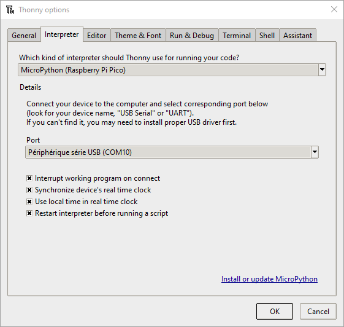
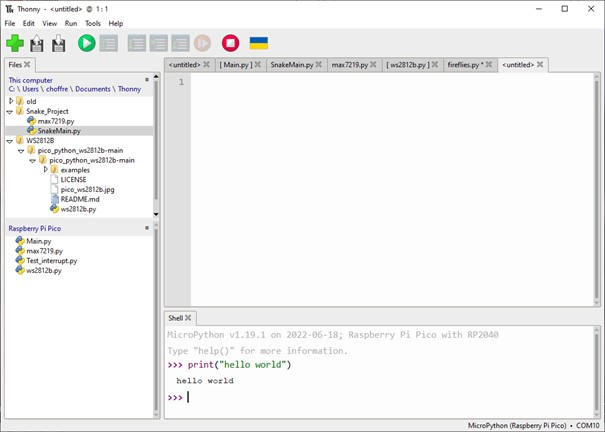

# Thonny IDE


Pour programmer en MicroPython, nous avons besoin d'un environnement de dévelopement. Le logiciel Thonny est utilisé.&#x20;

Installer la dernière version qui se trouve sur le lien suivant:


site de Thonny


Connecter la carte au pc avec le câble usb approprié.

Dans le logiciel Thonny, aller dans le menu "Tools" et puis "options". Dans l'onglet "Interpreter" choisissez MicroPython(Raspberry Pi Pico) et le port COM.

<figure><figcaption></figcaption></figure>

Si votre Pico n'a pas encore MicroPython installer, cliquer sur "Install or update MicroPython" puis choisir le "Target volume", la variante "MicroPython" (Raspberry Pi Pico ou Pico W) et la dernière version.

Thonny est composé d'une console de commande (Shell) et d'une partie éditeur de code. Dans le shell, taper la ligne de code suivante:

```
print("hello world")

```

<figure><figcaption></figcaption></figure>

Lorsque hello world est écrit en retour, la configuration est correct.&#x20;
