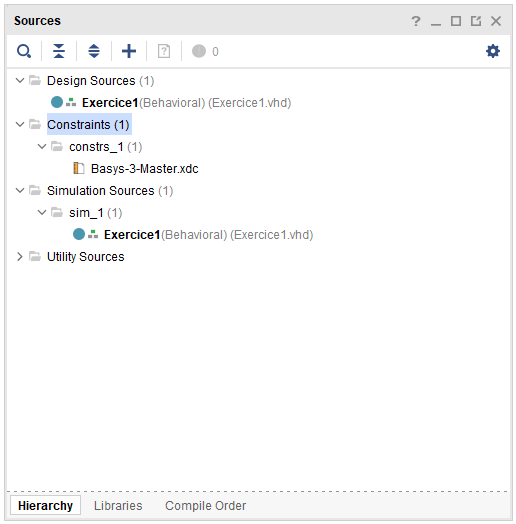

# Création d'un nouveau projet

Veuillez suivre la procédure suivante pour créer un nouveau projet.

Dans le menu **Files**, cliquez sur **New project**.


Ne pas mettre d'espace dans le nom du projet


<figure><figcaption></figcaption></figure>

Sélectionner "RTL Project" et décocher "Do not specify sources at this time"

<figure><figcaption></figcaption></figure>

Créer une source en cliquant sur le +, puis "Create file".&#x20;

<figure><figcaption></figcaption></figure>

Sélectionner le type VHDL et donner un nom au fichier. Vous pouvez donner le même nom que pour le projet.

<figure><figcaption></figcaption></figure>

Cliquez sur Next et ensuite ajouter le fichier de contrainte correspondant à la carte Basys 3 (Basys-3-Master.xdc). Ce fichier se trouve dans le dossier digilent-xdc-master que vous avez copier dans vos documents pendant la procédure d'installation. Cochez "Copy constraints files into project" et cliquez sur Next.

<figure><figcaption></figcaption></figure>

Rechercher et choisir la carte Basys 3 dans l'onglet "Boards".

<figure><figcaption></figcaption></figure>

Puis cliquez sur **Next** et puis **Finish**. Le projet est maintenant créé.

Vivado ouvre à présent une fenêtre pour définir les entrées et sorties du projet. Pour l'exercice 1, il y a 1 entrée SW0 et 1 sortie LD0 comme dans l'exemple ci-dessous.

<figure><figcaption></figcaption></figure>

Voici une vue du projet que vous devez obtenir.

<figure><figcaption></figcaption></figure>
