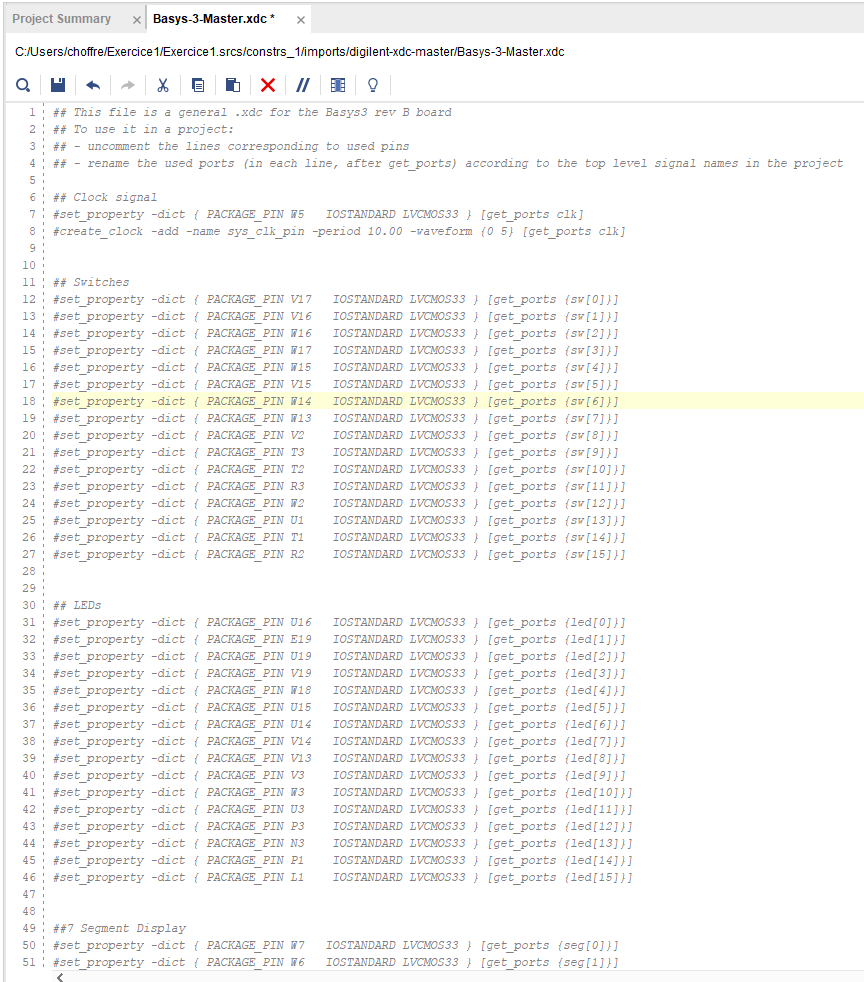
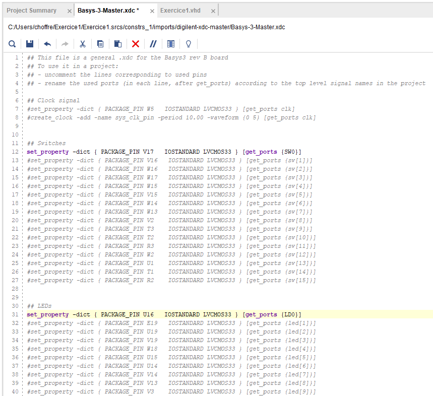

# Fichier de contraintes

Le fichier de contraintes Basys-3-Master.xdc contient, la description utile pour chaque entrée/sortie de la carte. Toutes les lignes sont actuellement commentées.

<figure><figcaption></figcaption></figure>

Par exemple, le 3ème paragraphe correspond aux 16 switches qui se trouvent la carte. La paragraphe suivant correspond aux 16 leds et ainis de suite...

Afin de définir les entrées et sorties utilisé, il faut décommenter la ligne en question et modifier le nom afin de correspondre au nom défini précédemment.&#x20;

Dans notre cas, on obtient donc le fichier suivant:

<figure><figcaption></figcaption></figure>

Un switch est utilisé et se nomme SW0 et la led utilisé LD0.
