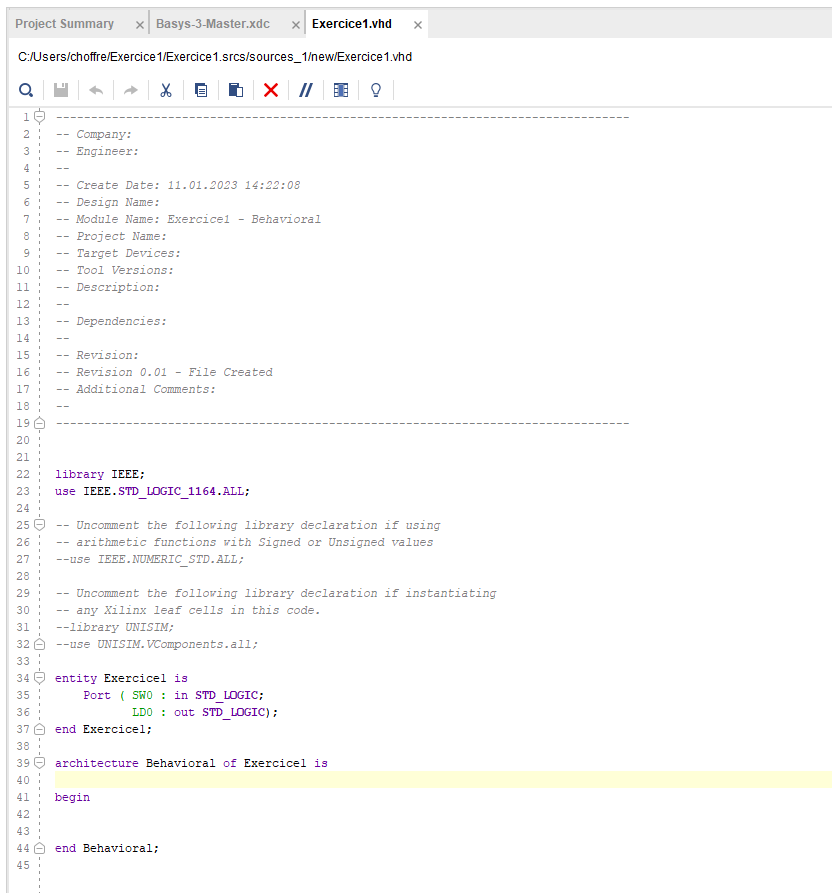
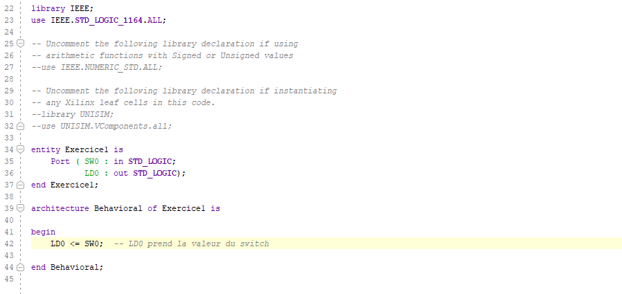

# Fichier source

Le fichier source créé se présente ainsi:

<figure><figcaption></figcaption></figure>

L'entité (ligne 34-37) décrit l'interface externe. Dans notre cas, un signal d'entrée SW0 et un signal de sortie LD0

L'architecture (ligne 39-44) décrit le fonctionnement interne, c'est à l'intérieur de cette partie que nous allons décrire le fonctionnement du module.

Voici l'exemple très simple de l'exercice 1. Le but est d'allumer la LED 0 lorsque le SW0 est à 1.&#x20;

<figure><figcaption></figcaption></figure>

Nous verrons les bases du langage VHDL plus tard.
