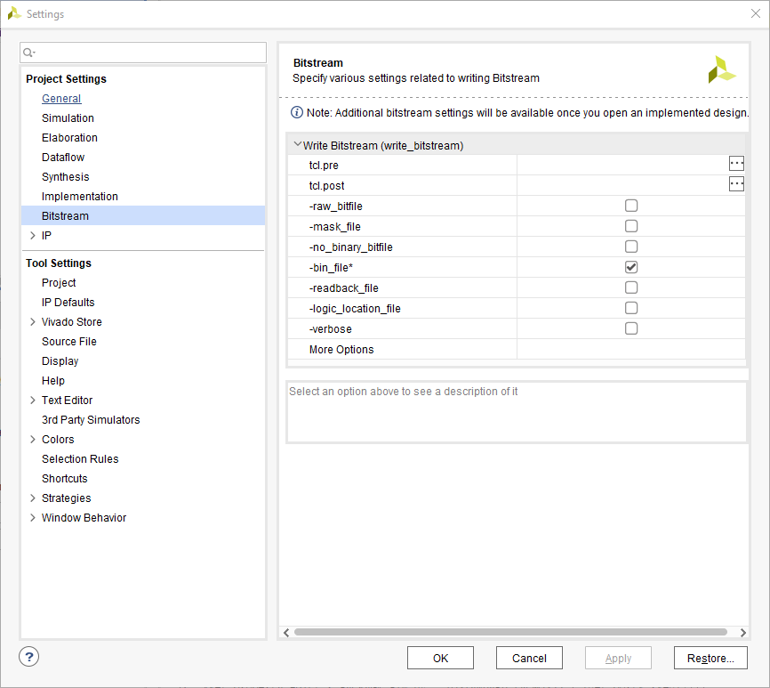
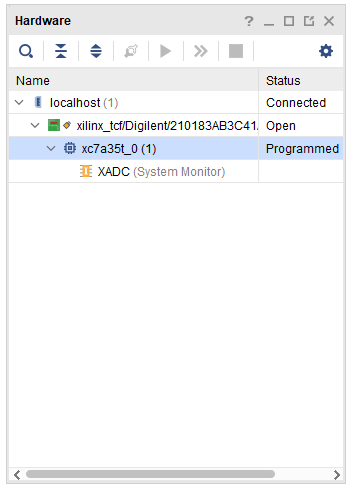
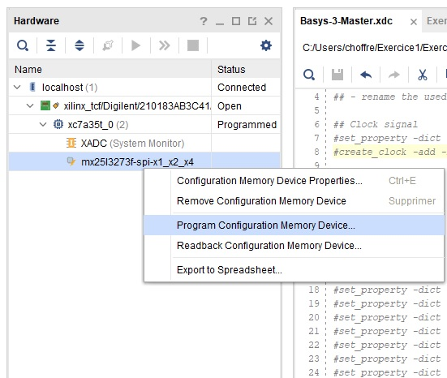
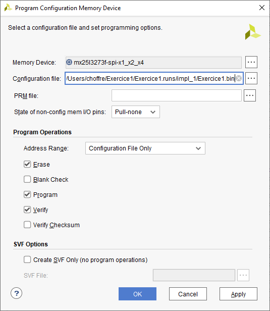

# Programmation de la flash

Lorsque l'on programme la FPGA comme vu précédemment, le programme n'est pas enregistrer en mémoire flash. Il est donc perdu lorsque la carte est éteinte.  En téléchargeant le programme dans la mémoire flash, ce dernier est directement charger dans la FPGA au moment du démarrage de la carte Basys 3.

Un fichier .bin est nécessaire pour charger la mémire flash. Cliquez dans le menu Tools, Settings et puis cocher l'option comme dans l'image suivante afin de générer ce fichier.

<figure><figcaption></figcaption></figure>

Dans le flow navigator sur la gauche de l'écran, "Program and debug", "Open hardware manager", cliquez sur "Open target", puis "auto connect". Lorsque la Basys 3 a été détecté, on obtient la vue suivante:

<figure><figcaption></figcaption></figure>

Faire un clique droit sur la FPGA, soit sur xc7a35t, puis cliquez sur "Add Configuration Memory Device". Sélectionner la mémoire Mx25l3273f comme dans l'image ci-dessous.

<figure><figcaption></figcaption></figure>

Ensuite faire clique droit sur la mémoire et cliquer sur "Program Configuration Memory Device".

<figure><figcaption></figcaption></figure>

Sélectionner le fichier .bin généré auparavant et cliquer sur ok.

<figure><figcaption></figcaption></figure>

La mémoire flash est maintenant programmé. Faire un ON/OFF avec le jumper JP1 en position QSPi et le programme en mémoire est automatiquement chargé au démarrage.&#x20;
