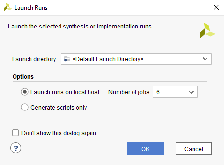
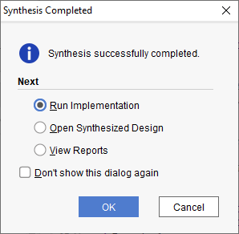
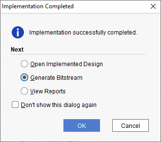
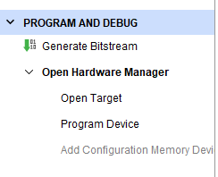
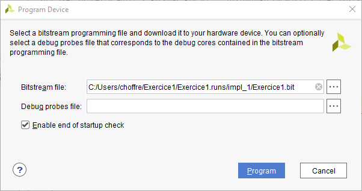

# Programmation de la FPGA

Une fois la description terminé. Il faut faire la synthèse du projet en cliquant sur le triangle vert ou en pressant F11. La fenêtre "Launch Runs" apparaît, cliquez sur "Ok".

<figure><figcaption></figcaption></figure>

Lorsque la synthèse s'est correctement passé, le message suivant apparaît.

<figure><figcaption></figcaption></figure>

Ensuite lancer l'implémentation en cliquant sur "Ok".

<figure><figcaption></figcaption></figure>

Lorsque l'implémentation est faite, sélectionner **Generate Bitstream** et cliquer sur OK pour générer le bitstream.&#x20;

Ensuite connecter la carte en cliquant sur **Open Target**, puis **Auto connect**.

<figure><figcaption></figcaption></figure>

Une fois la carte reconnue, cliquer sur Program Device.

Sélectionner le fichier .bit généré à l'étape précédente et programmer la FPGA.&#x20;

<figure><figcaption></figcaption></figure>


Bravo, la FPGA est maintenant programmée. Par contre, le programme sera effacé si vous éteignez la carte. Si vous désirez que le programme soit gardé en mémoire flash, veuillez suivre la procédure suivante.

